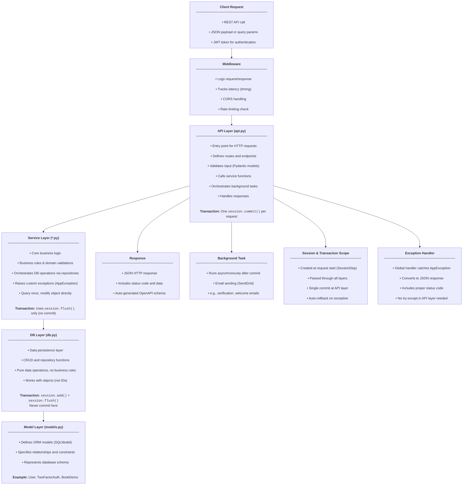

# Backend Architecture - Complete Guide

This document provides comprehensive architectural guidelines for the Sample backend, based on actual codebase analysis and established patterns.

## Table of Contents

1. [Layered Architecture](#layered-architecture)
2. [Layer Responsibilities](#layer-responsibilities)
3. [Exception Handling](#exception-handling)
4. [Session Management](#session-management)
5. [Naming Conventions](#naming-conventions)
6. [Module System](#module-system)
7. [Rate Limiting](#rate-limiting)
8. [Authentication & Authorization](#authentication--authorization)
9. [Quick Reference Checklist](#quick-reference-checklist)

---

## Layered Architecture

**Four-layer architecture with clear separation of concerns:**



**Key Principle: One session per request, one commit per request**

---

## Layer Responsibilities

### 1. DB Layer (`db.py`)

**Purpose:** Dumb CRUD operations. No business logic, no exceptions.

**Rules:**

- ✅ Simple database operations only
- ✅ Always `session.flush()`, NEVER `session.commit()`
- ✅ Work with fetched objects when possible (avoid re-queries)
- ✅ Methods take objects (not IDs) for `update()` and `delete()`
- ❌ No business logic
- ❌ No exceptions (except database errors)
- ❌ No validation

**Pattern Example** (from `backend/modules/user/db.py`):

```python
class UserDB:
    """Repository for user database operations."""

    def get_by_id(self, session: Session, user_id: UUID) -> Optional[User]:
        """Get user by ID."""
        return session.get(User, user_id)

    def get_by_email(self, session: Session, email: str) -> Optional[User]:
        """Get user by email address."""
        query = select(User).where(User.email == email)
        return session.exec(query).first()

    def create(
        self,
        session: Session,
        email: str,
        full_name: str,
        hashed_password: str,
        signup_verified: datetime | None = None,
        signup_token: str | None = None,
        auth_provider: str = "sample",
    ) -> User:
        """Create a new user."""
        user = User(
            email=email,
            full_name=full_name,
            hashed_password=hashed_password,
            signup_verified=signup_verified,
            signup_token=signup_token,
            auth_provider=auth_provider,
        )
        session.add(user)
        session.flush()  # ✓ Only flush, never commit
        return user

    def update(self, session: Session, user: User, user_data: dict) -> User:
        """Update existing user object (no re-query)."""
        for key, value in user_data.items():
            setattr(user, key, value)
        user.updated_at = datetime.now()
        session.flush()  # ✓ Only flush, never commit
        return user

    def delete(self, session: Session, user: User) -> None:
        """Delete existing user object (no re-query)."""
        session.delete(user)
        session.flush()  # ✓ Only flush, never commit

    def exists_by_email(self, session: Session, email: str) -> bool:
        """Check if user exists by email."""
        query = select(User.id).where(User.email == email)
        return session.exec(query).first() is not None


# Global instance (singleton pattern)
user_db = UserDB()
```

**Key Points:**

- `update()` and `delete()` take **User object**, not `user_id` (avoids redundant queries in service layer)
- Return types: `User`, `Optional[User]`, `List[User]`, `bool`, `None`
- Never check business rules (that's service layer's job)
- Always use `session.flush()`, never `session.commit()`

---

### 2. Service Layer (`*.py`)

**Purpose:** Business logic, validation, exception handling. Single source of truth for business rules.

**Rules:**

- ✅ All business logic lives here
- ✅ Raise exceptions for error cases
- ✅ Always `session.flush()`, NEVER `session.commit()`
- ✅ **Query once** at the start, then work with fetched object
- ✅ Modify object directly (avoid re-query in DB layer)
- ✅ Use descriptive method names without resource prefix
- ❌ No HTTP concerns (status codes handled by exceptions)
- ❌ No `session.commit()` (API layer responsibility)

**Pattern Example** (from `backend/modules/user/user.py`):

```python
class UserService:
    """Service class for user business logic."""

    def get(self, session: Session, user_id: UUID) -> Optional[User]:
        """Get user by ID."""
        return user_db.get_by_id(session, user_id)

    def create(
        self,
        session: Session,
        email: str,
        password: str,
        full_name: str,
    ) -> User:
        """Create a new user with signup verification."""
        # Business rule: email must be unique
        if user_db.exists_by_email(session, email):
            raise EmailAlreadyExists(email)

        # Business logic: hash password, generate token
        hashed_password = password_manager.get_hash(password)
        signup_token = token_manager.generate_signup_token()

        # Create user via DB layer
        user = user_db.create(
            session,
            email=email,
            full_name=full_name,
            hashed_password=hashed_password,
            signup_verified=None,
            signup_token=signup_token,
        )

        return user

    def update(self, session: Session, user_id: UUID, **kwargs) -> User:
        """Update user data."""
        # Query once at the start
        user = user_db.get_by_id(session, user_id)
        if not user:
            raise UserNotFound(str(user_id))

        # Business logic: handle password hashing
        if "password" in kwargs:
            kwargs["hashed_password"] = password_manager.get_hash(
                kwargs.pop("password")
            )

        # Update using fetched object (no re-query in DB layer)
        return user_db.update(session, user, kwargs)

    def delete(self, session: Session, user_id: UUID) -> None:
        """Delete a user."""
        # Query once at the start
        user = user_db.get_by_id(session, user_id)
        if not user:
            raise UserNotFound(str(user_id))

        # Delete using fetched object (no re-query in DB layer)
        user_db.delete(session, user)

    def authenticate(self, session: Session, email: str, password: str) -> User:
        """Authenticate user with email and password."""
        user = user_db.get_by_email(session, email)
        if not user:
            raise InvalidCredentials()
        if not password_manager.verify(password, user.hashed_password):
            raise InvalidCredentials()

        return user

    def change_password(
        self, session: Session, user_id: UUID, old_password: str, new_password: str
    ) -> User:
        """Change user password after verifying old password."""
        # Query once at the start
        user = user_db.get_by_id(session, user_id)
        if not user:
            raise UserNotFound(str(user_id))

        # Business rule: verify old password
        if not password_manager.verify(old_password, user.hashed_password):
            raise InvalidPasswordChange()

        # Update password directly on fetched object (no re-query)
        user.hashed_password = password_manager.get_hash(new_password)
        user.updated_at = datetime.now()
        session.flush()  # ✓ Only flush, never commit

        return user

    def verify_signup(self, session: Session, user_id: UUID, signup_token: str) -> User:
        """Verify user signup with 6-digit verification code."""
        # Query once at the start
        user = user_db.get_by_id(session, user_id)
        if not user:
            raise UserNotFound(str(user_id))

        # Business rules
        if user.signup_verified:
            raise UserAlreadyVerified()
        if user.signup_token != signup_token:
            raise InvalidVerificationCode()

        # Update directly on fetched object (no re-query)
        user.signup_token = None
        user.signup_verified = datetime.now()
        user.updated_at = datetime.now()
        session.flush()  # ✓ Only flush, never commit

        return user


# Global instance (singleton pattern)
user_service = UserService()
```

**Key Points:**

- **Query once** at the start of the method
- **Validate** business rules (email uniqueness, password match, etc.)
- **Modify** the fetched object directly in service layer when appropriate
- Pass fetched object to DB layer's `update()`/`delete()` (avoid re-query)
- **Always raise exceptions** for error cases (never return `None` for operations that should always succeed)
- Simple getters can return `Optional[User]`, but operations should raise exceptions
- Use clean method names: `create()`, `update()`, `delete()` (not `create_user()`, `update_user()`)

---

### 3. API Layer (`api.py`)

**Purpose:** HTTP interface, request/response handling, orchestration, transaction management.

**Rules:**

- ✅ Handle HTTP requests/responses
- ✅ Validate input (Pydantic models with validators)
- ✅ Orchestrate multiple services
- ✅ Manage background tasks
- ✅ **ONLY place for `session.commit()`** (at the END with `# Commit` comment)
- ✅ Let exceptions bubble up (global handler catches them)
- ✅ Use rate limiting dependencies where appropriate
- ❌ No business logic (delegate to service layer)
- ❌ No database queries (use service layer)
- ❌ No redundant `if not` checks (service raises exceptions)

**Pattern Example** (from `backend/modules/user/api.py`):

```python
from fastapi import APIRouter, BackgroundTasks, Depends
from pydantic import BaseModel, field_validator

from backend.api.deps import SessionDep, CurrentUserDep, CurrentUserAllowUnverifiedDep
from backend.core.rate_limit import rate_limit
from backend.core.validation import (
    is_valid_email,
    is_valid_password,
    normalize_email,
)
from backend.models import UserPublic

from .user import user_service
from .background import send_verification_email_task
from .exceptions import UserAlreadyVerified

router = APIRouter()


# Request models with validation
class SignupRequest(BaseModel):
    email: str
    password: str
    full_name: str

    @field_validator("email")
    @classmethod
    def validate_email_field(cls, v: str) -> str:
        """Validate email format."""
        if not is_valid_email(v):
            raise InvalidEmailFormat()
        return normalize_email(v)

    @field_validator("password")
    @classmethod
    def validate_password_field(cls, v: str) -> str:
        """Validate password."""
        if not is_valid_password(v):
            raise InvalidPasswordFormat()
        return v


# Response models (NO "Response" suffix)
class Message(BaseModel):
    """Simple message response."""
    message: str


class Auth(BaseModel):
    """Authentication response with token and user data."""
    access_token: str
    user: UserPublic


# Endpoints with rate limiting
@router.post(
    "/signup",
    response_model=Auth,
    dependencies=[Depends(rate_limit(2, hours=24))]  # Rate limit: 2 per 24h
)
def signup(
    user_data: SignupRequest,
    session: SessionDep,
    background_tasks: BackgroundTasks,
):
    """Sign up a new user and send verification email."""
    # Service handles business logic and exceptions
    user = user_service.create(
        session,
        email=user_data.email,
        password=user_data.password,
        full_name=user_data.full_name,
    )

    # Create 2FA settings for user
    two_fa_service.create(session, user.id)

    # Background task (email sending)
    background_tasks.add_task(
        send_verification_email_task,
        email=user.email,
        name=user.full_name,
        token=user.signup_token,
    )

    # Generate JWT token
    access_token = create_access_token(user.id)

    # Commit (ONLY place for commit, at the END)
    session.commit()

    return Auth(
        access_token=access_token,
        user=UserPublic.model_validate(user),
    )


@router.post("/verify-signup", response_model=UserPublic)
def verify_signup(
    current_user: CurrentUserAllowUnverifiedDep,
    data: VerifySignupRequest,
    session: SessionDep,
    background_tasks: BackgroundTasks,
):
    """Verify current user's signup with 6-digit verification code."""
    # Service raises exceptions if validation fails
    user = user_service.verify_signup(session, current_user.id, data.signup_token)

    # Background task
    background_tasks.add_task(
        send_welcome_email_task,
        email=user.email,
        name=user.full_name,
    )

    # Commit
    session.commit()

    return UserPublic.model_validate(user)


@router.put("/", response_model=UserPublic)
def update(
    current_user: CurrentUserDep,
    user_data: UpdateUserRequest,
    session: SessionDep,
):
    """Update current user's data."""
    # No need for 'if not user' check - service raises UserNotFound exception
    user = user_service.update(
        session,
        current_user.id,
        **user_data.model_dump(exclude_unset=True)
    )

    # Commit
    session.commit()

    return UserPublic.model_validate(user)


@router.delete("/", response_model=Message)
def delete(current_user: CurrentUserDep, session: SessionDep):
    """Delete current user's account."""
    # Service raises UserNotFound if not found (no need to check here)
    user_service.delete(session, current_user.id)

    # Commit
    session.commit()

    return Message(message="User deleted successfully")


@router.post("/change-password", response_model=Message)
def change_password(
    current_user: CurrentUserDep,
    password_data: ChangePasswordRequest,
    session: SessionDep,
):
    """Change current user's password."""
    # Service handles all validation and raises exceptions
    user_service.change_password(
        session,
        current_user.id,
        password_data.old_password,
        password_data.new_password,
    )

    # Commit
    session.commit()

    return Message(message="Password changed successfully")
```

**Key Points:**

- **No `if not user:` checks** - service layer raises exceptions
- **Only one `session.commit()`** per endpoint (at the END with `# Commit` comment)
- **Clean orchestration** - call services, manage background tasks, commit
- Let exceptions bubble up - global handler returns proper HTTP responses
- Use rate limiting dependencies: `dependencies=[Depends(rate_limit(2, hours=24))]`
- Response models have NO "Response" suffix (`Auth` not `AuthResponse`)
- Function names are simple actions (`signup`, `login`, not `user_signup`, `user_login`)

---

## Exception Handling

### Overview

Instead of manually checking for errors in every endpoint with `if not result: raise HTTPException(...)`, we use a **centralized exception handling** approach that provides clean, consistent, and maintainable error handling across the entire application.

**Benefits:**

- ✅ **Clean API endpoints** - No error handling clutter
- ✅ **Consistent error responses** - All errors follow the same format
- ✅ **Type-safe** - Exceptions are well-defined classes
- ✅ **Centralized** - One place to update error handling
- ✅ **Self-documenting** - Exception names describe what went wrong

### Base Exception Class

All custom exceptions inherit from `AppException`:

```python
# backend/core/exceptions.py

class AppException(Exception):
    """Base exception with HTTP status code."""
    def __init__(self, message: str, status_code: int = 400):
        self.message = message
        self.status_code = status_code
        super().__init__(self.message)
```

### Module-Specific Exceptions

**Pattern** (from `backend/modules/user/exceptions.py`):

```python
from backend.core.exceptions import AppException


class UserNotFound(AppException):
    """Raised when user is not found."""
    MESSAGE = "User not found"

    def __init__(self, user_id: str | None = None):
        message = f"User with ID '{user_id}' not found" if user_id else self.MESSAGE
        super().__init__(message, status_code=404)


class EmailAlreadyExists(AppException):
    """Raised when email is already registered."""
    MESSAGE = "Email already registered"

    def __init__(self, email: str | None = None):
        message = f"Email '{email}' is already registered" if email else self.MESSAGE
        super().__init__(message, status_code=400)


class InvalidCredentials(AppException):
    """Raised when login credentials are invalid."""
    MESSAGE = "Invalid email or password"

    def __init__(self):
        super().__init__(self.MESSAGE, status_code=401)


class UserAlreadyVerified(AppException):
    """Raised when user is already verified."""
    MESSAGE = "User is already verified"

    def __init__(self):
        super().__init__(self.MESSAGE, status_code=400)


class InvalidVerificationCode(AppException):
    """Raised when verification code is invalid."""
    MESSAGE = "Invalid verification code"

    def __init__(self):
        super().__init__(self.MESSAGE, status_code=400)


class InvalidPasswordChange(AppException):
    """Raised when password change fails validation."""
    MESSAGE = "Current password is incorrect"

    def __init__(self):
        super().__init__(self.MESSAGE, status_code=400)
```

### Common Exceptions

For exceptions used across multiple modules (in `backend/core/exceptions.py`):

```python
class InvalidEmailFormat(AppException):
    """Raised when email format is invalid."""
    MESSAGE = "Invalid email address format"

    def __init__(self):
        super().__init__(self.MESSAGE, status_code=400)


class InvalidPasswordFormat(AppException):
    """Raised when password doesn't meet requirements."""
    MESSAGE = "Password must be at least 8 characters long"

    def __init__(self, message: str | None = None):
        super().__init__(message or self.MESSAGE, status_code=400)
```

### Global Exception Handler

**Configured in `main.py`**:

```python
@app.exception_handler(AppException)
async def app_exception_handler(req: Request, exc: AppException):
    """
    Handle custom application exceptions and convert to HTTP responses.

    This provides a centralized way to handle all business logic exceptions
    without needing try-except blocks in every endpoint.
    """
    return JSONResponse(
        status_code=exc.status_code,
        content={"detail": exc.message},
    )
```

### Complete Flow Example

**Before (manual error handling):**

```python
@router.post("/login")
def login(data: LoginRequest, session: SessionDep):
    user = user_service.authenticate(session, data.email, data.password)
    if not user:
        raise HTTPException(status_code=401, detail="Invalid email or password")
    return UserPublic.model_validate(user)
```

**After (exception-based):**

```python
# Service Layer - Raise exceptions
def authenticate(self, session: Session, email: str, password: str) -> User:
    """Authenticate user with email and password."""
    user = user_db.get_by_email(session, email)
    if not user:
        raise InvalidCredentials()  # ✓ Automatically becomes 401 response
    if not password_manager.verify(password, user.hashed_password):
        raise InvalidCredentials()
    return user

# API Layer - Let exceptions bubble up
@router.post("/login")
def login(data: LoginRequest, session: SessionDep):
    """Login user. Raises InvalidCredentials if wrong email/password."""
    user = user_service.authenticate(session, data.email, data.password)
    # No error handling needed - global handler catches exceptions
    return UserPublic.model_validate(user)
```

### Error Response Format

All exceptions return consistent JSON:

```json
{
  "detail": "Email address 'test@example.com' is already registered"
}
```

Status code is set based on the exception's `status_code` attribute.

### Available Exceptions (User Module)

| Exception                 | Status Code | Use Case                           |
| ------------------------- | ----------- | ---------------------------------- |
| `EmailAlreadyExists`      | 400         | Email is already registered        |
| `InvalidCredentials`      | 401         | Login email or password is wrong   |
| `UserNotFound`            | 404         | User doesn't exist                 |
| `UserAlreadyVerified`     | 400         | User tried to verify again         |
| `InvalidVerificationCode` | 400         | Verification code is wrong/expired |
| `InvalidPasswordChange`   | 400         | Old password is incorrect          |

### Creating New Exceptions

**1. Define in appropriate file:**

```python
# backend/modules/document/exceptions.py (module-specific)
# OR backend/core/exceptions.py (common across modules)

class InvalidDocumentFormat(AppException):
    """Raised when uploaded document has invalid format."""
    MESSAGE = "Invalid document format"

    def __init__(self, allowed_formats: list[str]):
        formats = ", ".join(allowed_formats)
        super().__init__(
            f"Invalid document format. Allowed formats: {formats}",
            status_code=400
        )
```

**2. Import and raise in service layer:**

```python
from .exceptions import InvalidDocumentFormat

class DocumentService:
    def upload(self, file: UploadFile):
        allowed_formats = ["pdf", "docx", "txt"]
        if file.extension not in allowed_formats:
            raise InvalidDocumentFormat(allowed_formats)
        # Process document...
```

**3. That's it!**

No changes needed in API layer - FastAPI automatically catches and handles it via the global exception handler.

### When to Use Try-Except

You still need try-except for:

1. **External API calls** - Catch network errors, timeouts
2. **Database errors** - Catch SQLAlchemy exceptions
3. **Unknown errors** - Catch and convert to `InternalServerError`

Example:

```python
try:
    response = requests.post(external_api_url, json=data)
    response.raise_for_status()
except requests.RequestException as e:
    raise InternalServerError("Failed to communicate with external service")
```

### Best Practices

**DO:**

- ✅ Create `{module}/exceptions.py` per module
- ✅ Define `MESSAGE` class constant
- ✅ Use descriptive names (`UserNotFound`, not `NotFound`)
- ✅ Include optional context params (user_id, email, etc.)
- ✅ Raise exceptions in service layer
- ✅ Document what exceptions your functions raise
- ✅ Let global handler convert exceptions to HTTP responses

**DON'T:**

- ❌ Raise `HTTPException` directly in service layer
- ❌ Return `None` to indicate errors (raise exception instead)
- ❌ Catch `AppException` in API endpoints (let FastAPI handle it)
- ❌ Use generic exceptions for specific errors

---

## Session Management

### The Golden Rule

**One session per request, one commit per request.**

### Rules by Layer

| Layer             | Allowed                            | Not Allowed           |
| ----------------- | ---------------------------------- | --------------------- |
| **DB Layer**      | `session.add()`, `session.flush()` | ❌ `session.commit()` |
| **Service Layer** | `session.flush()`                  | ❌ `session.commit()` |
| **API Layer**     | `session.commit()` (once, at END)  | ❌ Multiple commits   |

### Why This Pattern?

✅ **Clear transaction boundaries** - All changes commit or rollback together
✅ **Atomic operations** - All or nothing
✅ **Composable services** - Services can call each other safely
✅ **Better error handling** - Rollback happens automatically on exception
✅ **No redundant queries** - Query once, work with object

### Example: Good Pattern (Current Codebase)

```python
# ✅ GOOD: Single query, consistent exceptions, clean separation

# DB Layer (backend/modules/user/db.py)
def update(self, session: Session, user: User, user_data: dict) -> User:
    """Update existing user object."""
    for key, value in user_data.items():
        setattr(user, key, value)
    user.updated_at = datetime.now()
    session.flush()  # ✓ Only flush
    return user

# Service Layer (backend/modules/user/user.py)
def change_password(
    self, session: Session, user_id: UUID, old_pw: str, new_pw: str
) -> User:
    """Change user password after verifying old password."""
    # Query once at the start
    user = user_db.get_by_id(session, user_id)
    if not user:
        raise UserNotFound(str(user_id))
    if not password_manager.verify(old_pw, user.hashed_password):
        raise InvalidPasswordChange()

    # Update directly on fetched object (no re-query)
    user.hashed_password = password_manager.get_hash(new_pw)
    user.updated_at = datetime.now()
    session.flush()  # ✓ Only flush

    return user

# API Layer (backend/modules/user/api.py)
@router.post("/change-password", response_model=Message)
def change_password(
    current_user: CurrentUserDep,
    password_data: ChangePasswordRequest,
    session: SessionDep,
):
    """Change current user's password."""
    user_service.change_password(
        session,
        current_user.id,
        password_data.old_password,
        password_data.new_password,
    )

    # Commit (ONLY here, at the END)
    session.commit()

    return Message(message="Password changed successfully")
```

**Benefits:**

- 1 database query (fetch once, work with object)
- Consistent exception handling
- Clean separation of concerns
- No redundant checks

---

## Naming Conventions

### Service and Repository Methods

**Rule:** Class name provides context - don't repeat resource name in methods.

```python
# ✅ CORRECT
class UserService:
    def get(self, session: Session, user_id: UUID) -> Optional[User]: ...
    def get_by_email(self, session: Session, email: str) -> Optional[User]: ...
    def create(self, session: Session, **kwargs) -> User: ...
    def update(self, session: Session, user_id: UUID, **kwargs) -> User: ...
    def delete(self, session: Session, user_id: UUID) -> None: ...
    def authenticate(self, session: Session, email: str, password: str) -> User: ...

# ❌ WRONG - Redundant "user" prefix
class UserService:
    def get_user(self, ...) -> Optional[User]: ...       # Redundant
    def create_user(self, ...) -> User: ...              # Redundant
    def update_user(self, ...) -> User: ...              # Redundant
```

### API Endpoints

**Rule:** URL path provides context - use simple action names.

```python
# ✅ CORRECT (from backend/modules/user/api.py)
@router.post("/signup")
def signup(data: SignupRequest):
    """Sign up a new user."""
    # Generated client: UsersService.signup()
    pass

@router.post("/login")
def login(data: LoginRequest):
    """Login user."""
    # Generated client: UsersService.login()
    pass

@router.get("/me")
def get_me(current_user: CurrentUserDep):
    """Get current user profile."""
    # Generated client: UsersService.getMe()
    pass

@router.put("/")
def update(current_user: CurrentUserDep, data: UpdateUserRequest):
    """Update current user."""
    # Generated client: UsersService.update()
    pass

# ❌ WRONG - Redundant context
@router.post("/login")
def user_login_endpoint(data: LoginRequest):
    # Generated client: UsersService.userLoginEndpoint() - redundant!
    pass
```

### Response Models

**Rule:** Don't add "Response" suffix - the context is clear from `response_model=`.

```python
# ✅ CORRECT (from backend/modules/user/api.py)
class Auth(BaseModel):
    """Authentication response with token and user data."""
    access_token: str
    user: UserPublic

class Message(BaseModel):
    """Simple message response."""
    message: str

@router.post("/login", response_model=Auth)  # Clear from response_model
def login(data: LoginRequest):
    return Auth(access_token=token, user=user)

# ❌ WRONG - Redundant suffix
class AuthResponse(BaseModel):  # "Response" is redundant
    access_token: str
    user: UserPublic
```

### Naming Pattern Table

| Pattern                | Method/Function Name | NOT This                 |
| ---------------------- | -------------------- | ------------------------ |
| **Repository Methods** |                      |                          |
| Get by ID              | `get_by_id()`        | ❌ `get_user_by_id()`    |
| Get by field           | `get_by_email()`     | ❌ `get_user_by_email()` |
| Create                 | `create()`           | ❌ `create_user()`       |
| Update                 | `update()`           | ❌ `update_user()`       |
| Delete                 | `delete()`           | ❌ `delete_user()`       |
| **Service Methods**    |                      |                          |
| Get by ID              | `get()`              | ❌ `get_user()`          |
| Get by field           | `get_by_email()`     | ❌ `get_user_by_email()` |
| Create                 | `create()`           | ❌ `create_user()`       |
| Update                 | `update()`           | ❌ `update_user()`       |
| Delete                 | `delete()`           | ❌ `delete_user()`       |
| Action verb            | `authenticate()`     | ✅ Good                  |
| Action verb            | `verify_signup()`    | ✅ Good                  |
| **API Endpoints**      |                      |                          |
| Signup                 | `signup()`           | ❌ `user_signup()`       |
| Login                  | `login()`            | ❌ `user_login()`        |
| Get profile            | `get_me()`           | ✅ Good                  |
| Update                 | `update()`           | ✅ Good                  |
| Delete                 | `delete()`           | ✅ Good                  |
| **Response Models**    |                      |                          |
| Auth response          | `Auth`               | ❌ `AuthResponse`        |
| Message response       | `Message`            | ❌ `MessageResponse`     |
| User public            | `UserPublic`         | ✅ Good                  |

---

## Module System

### Module Registration

**Pattern** (from `backend/modules/registry.py`):

```python
from dataclasses import dataclass
from typing import List
from fastapi import APIRouter


@dataclass
class ModuleConfig:
    name: str
    router: APIRouter
    prefix: str
    tags: List[str]
    enabled: bool = True


MODULES = [
    ModuleConfig(
        name="health",
        router=lambda: __import__(
            "backend.modules.health.api", fromlist=["router"]
        ).router,
        prefix="",
        tags=["Health"],
    ),
    ModuleConfig(
        name="user",
        router=lambda: __import__(
            "backend.modules.user.api", fromlist=["router"]
        ).router,
        prefix="/user",
        tags=["Users"],
    ),
    ModuleConfig(
        name="two_fa",
        router=lambda: __import__(
            "backend.modules.two_fa.api", fromlist=["router"]
        ).router,
        prefix="/two_fa",
        tags=["TwoFA"],
    ),
    # ... more modules
]


def get_api_router() -> APIRouter:
    """Create and return the main API router with all registered modules."""
    api_router = APIRouter()

    for module in MODULES:
        if module.enabled:
            api_router.include_router(
                module.router(), prefix=module.prefix, tags=module.tags
            )

    return api_router
```

### Module Structure

Each module should have:

- `api.py` - FastAPI endpoints (required)
- `{module}.py` - Service layer (required)
- `db.py` - Repository layer (required for modules with database operations)
- `exceptions.py` - Module-specific exceptions (required)
- `background.py` - Background tasks (optional, for email/async operations)
- `email.py` - Email template rendering (optional)
- `lib.py` - Utility functions (optional)

**Example Module Structure**:

```
backend/modules/user/
├── __init__.py
├── api.py              # FastAPI endpoints
├── user.py             # Service layer (UserService)
├── db.py               # Repository layer (UserDB)
├── exceptions.py       # User-specific exceptions
├── background.py       # Background tasks (email sending)
├── email.py            # Email template rendering
└── lib.py              # Utility functions
```

---

## Rate Limiting

### Implementation

**Pattern** (from `backend/core/rate_limit.py`):

```python
from fastapi import Request
from fastapi_limiter import FastAPILimiter
from fastapi_limiter.depends import RateLimiter
from redis import asyncio as aioredis

from backend.core.auth import get_user_id_from_token
from backend.core.config import settings


async def get_identifier(request: Request) -> str:
    """
    Get identifier for rate limiting.

    Uses user ID if authenticated (from JWT token), otherwise falls back to IP address.
    This ensures authenticated users have per-user limits while unauthenticated
    requests are limited by IP.
    """
    auth_header = request.headers.get("Authorization")
    if auth_header and auth_header.startswith("Bearer "):
        token = auth_header.split(" ")[1]
        try:
            user_id = get_user_id_from_token(token)
            if user_id:
                return f"user:{user_id}"
        except Exception:
            pass

    # Fallback to IP address
    forwarded = request.headers.get("X-Forwarded-For")
    if forwarded:
        return forwarded.split(",")[0].strip()
    return request.client.host if request.client else "unknown"


def rate_limit(
    times: int,
    seconds: int = 0,
    minutes: int = 0,
    hours: int = 0,
) -> RateLimiter:
    """
    Create a rate limiter dependency for endpoints.

    Args:
        times: Number of allowed requests
        seconds: Time window in seconds
        minutes: Time window in minutes
        hours: Time window in hours

    Returns:
        RateLimiter dependency
    """
    return RateLimiter(
        times=times,
        seconds=seconds,
        minutes=minutes,
        hours=hours,
        identifier=get_identifier,
    )


async def init_rate_limiter():
    """Initialize rate limiter with Redis connection."""
    global redis_client
    redis_client = await aioredis.from_url(
        settings.REDIS_URL,
        encoding="utf-8",
        decode_responses=True,
    )
    await FastAPILimiter.init(redis_client)
```

### Usage in Endpoints

```python
# Signup - 2 attempts per 24 hours
@router.post("/signup", dependencies=[Depends(rate_limit(2, hours=24))])
def signup(data: SignupRequest, session: SessionDep):
    """Sign up a new user."""
    pass

# Resend verification - 1 attempt per 5 minutes
@router.post("/resend-verification", dependencies=[Depends(rate_limit(1, minutes=5))])
def resend_verification(current_user: CurrentUserAllowUnverifiedDep):
    """Resend verification email."""
    pass

# Profile picture upload - 5 attempts per hour
@router.post("/profile-picture", dependencies=[Depends(rate_limit(5, hours=1))])
def update_profile_picture(data: UpdateProfilePictureRequest):
    """Upload or update profile picture."""
    pass
```

### Identifier Strategy

- **Authenticated requests**: Rate limited by user ID (from JWT token)

  - Each user has independent limits
  - Users behind same IP don't affect each other
  - Can't bypass by switching IPs (tied to account)

- **Unauthenticated requests**: Rate limited by IP address
  - Prevents brute-force from same IP
  - Works for login, signup, verify-signup
  - Respects `X-Forwarded-For` header (proxies/load balancers)

---

## Authentication & Authorization

### Dependencies

**Pattern** (from `backend/api/deps.py`):

```python
from typing import Annotated
from fastapi import Depends
from sqlmodel import Session

from backend.core.auth import (
    get_current_admin,
    get_current_user,
    get_current_user_allow_unverified,
)
from backend.core.database import get_db
from backend.models import User

SessionDep = Annotated[Session, Depends(get_db)]

CurrentUserDep = Annotated[User, Depends(get_current_user)]
CurrentUserAllowUnverifiedDep = Annotated[
    User, Depends(get_current_user_allow_unverified)
]
CurrentAdminDep = Annotated[User, Depends(get_current_admin)]
```

### Usage

```python
# Allows both verified and unverified users (for /me, /verify-signup)
@router.get("/me", response_model=UserPublic)
def get_me(current_user: CurrentUserAllowUnverifiedDep):
    return UserPublic.model_validate(current_user)

# Requires verified users only
@router.get("/profile", response_model=UserPublic)
def get_profile(current_user: CurrentUserDep, session: SessionDep):
    # User must be verified
    return response

# Requires admin users only
@router.get("/admin/users")
def list_users(current_admin: CurrentAdminDep, session: SessionDep):
    # User must be admin
    return users

# Admin check without needing user object
@router.get("/health", dependencies=[Depends(get_current_admin)])
def check():
    return {"status": "healthy"}
```

---

## Quick Reference Checklist

### DB Layer (`db.py`)

- [ ] Methods take objects (not IDs) for `update()`/`delete()`
- [ ] Only `session.flush()`, never `session.commit()`
- [ ] Return types: `User`, `Optional[User]`, `bool`, `None`
- [ ] No business logic, no exceptions
- [ ] Clean method names without resource prefix

### Service Layer (`*.py`)

- [ ] All business logic here
- [ ] Query once at start, work with object
- [ ] Raise exceptions for errors (never return `None` for operations)
- [ ] Only `session.flush()`, never `session.commit()`
- [ ] Clean method names (no resource prefix: `get()` not `get_user()`)
- [ ] Pass objects to DB layer's `update()`/`delete()`

### API Layer (`api.py`)

- [ ] Use `CurrentUserDep` for user-specific operations
- [ ] No redundant `if not` checks (service raises exceptions)
- [ ] Only one `session.commit()` per endpoint (at END with `# Commit` comment)
- [ ] Let exceptions bubble up (global handler catches)
- [ ] Clean function names (simple actions: `signup`, `login`)
- [ ] Response models NO "Response" suffix (`Auth` not `AuthResponse`)
- [ ] Apply rate limiting: `dependencies=[Depends(rate_limit(times, hours=X))]`

### Exceptions

- [ ] Module-specific exceptions in `{module}/exceptions.py`
- [ ] Common exceptions in `backend/core/exceptions.py`
- [ ] Raise in service layer, let bubble to API layer
- [ ] Include `MESSAGE` class constant
- [ ] Proper HTTP status codes
- [ ] Descriptive names with optional context params

### Naming

- [ ] Service methods: `get()`, `create()`, `update()` (not `get_user()`, `create_user()`)
- [ ] API functions: `login()`, `signup()` (not `user_login()`, `user_signup()`)
- [ ] Response models: `Auth`, `Message` (not `AuthResponse`, `MessageResponse`)

---

## Benefits of This Architecture

✅ **No redundant queries** - Query once, work with object
✅ **Consistent exception handling** - All in service layer
✅ **Clear separation of concerns** - Each layer has single responsibility
✅ **Atomic transactions** - All or nothing with single commit
✅ **Easier to test** - Service layer is pure business logic
✅ **Composable services** - Services can call each other safely
✅ **Better error messages** - Exceptions have context
✅ **Cleaner code** - No redundant checks in API layer
✅ **Maintainable** - Clear patterns across all modules

---

**Last Updated**: 2025-10-17
**Source**: Comprehensive analysis of Sample codebase
