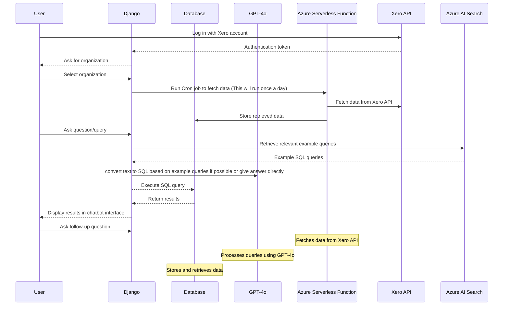

# Sample-AI

## High-Level User Flow

- User visits the website and logs in with their Xero account.
- The user selects the organization from which they want to retrieve data.
- Azure serverless function is called to fetch data from the Xero API.
- The retrieved data is stored in the SQL database.
- User can ask questions related to their data using the chatbot interface.
- The chatbot processes the user's query and categorizes it if it needs to convert text to SQL or not.
  - If the query needs to convert text to SQL, it uses the GPT-4o model and gets example SQL queries with SQL Schema from the Azure AI Search based on the user's query.
  - If a query does not need to convert text to SQL, it uses the GPT-4o model to get the answer directly.
  - If files are attached, the GPT-4o model is used to get the answer directly.
- The chatbot returns the answer to the user.
- Users can view the retrieved data in a user-friendly format.
- Users can ask follow-up questions or request additional information.
- User can log out.

## Sequence Diagram

